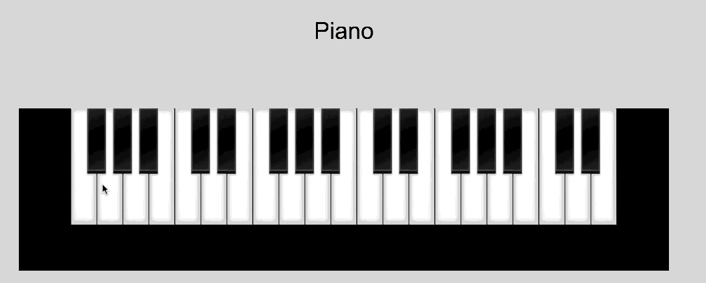

# onlinePiano-halogen
### [Play Piano](https://sainiaditi.github.io/onlinePiano-halogen/dist/index.html)

## Getting Started
```
$ git clone https://github.com/sainiaditi/onlinePiano-halogen.git
$ cd onlinePiano-halogen
$ npm i
$ bower i
$ pulp build
$ npm start
```
Open http://localhost:8080 in your browser
## Preview

